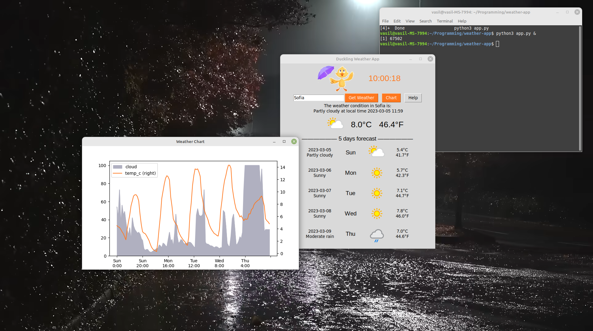
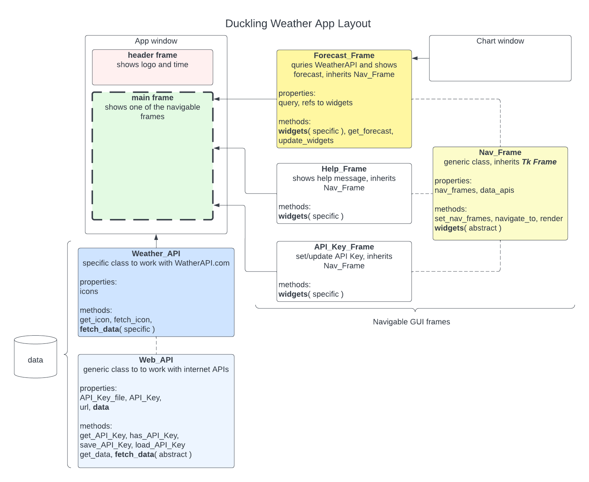

# weather-app

## Summary
The goal of this learning project is to create a weather desktop application in Python that gets and shows the current weather conditions and forecast for a specific location. 
As this is a learning project it contains the application and development files - see **Development Notes** section below.

### Project requirments
This project should:
* Use the requests library to make an API call to a weather service (e.g. OpenWeatherMap) to retrieve the weather data for a specific location.
* Use the json library to parse the JSON data returned by the API call.
* Use the tkinter library to create a GUI for the app, including widgets such as labels, buttons and text boxes.
* Use the Pillow library to display the weather icons.
* Use the datetime library to display the current time and date.

**Notes:**
1. For this project decided to use www.weatherapi.com for getting current conditiopns and forecast
2. The app requires an API Key from www.weatherapi.com and have trial period of using Pro+ features for free
3. The app uses icons from www.weatherapi.com as per the API documentation
4. In addition to the original requirments, the app shows a grapic window to utilise more of the API data and demonstrate Pandas and matplotlib usage

### App files:
* ***app.py*** - Main, final application with split class files (modules), error handling and detailed comments
* *Web_API.py* - a basic internet requests class - to be inherited by Weather_API class
* *Weather_API.py* - data class to fetch and store all data for the application
* *Basic_Frame.py* - a basic frame that clears its container and render new widgets - to be inherited by all visual classes
* *Forecast_Frame.py* - main view with query dialog and view of the forcast data
* *API_Key_Frame.py* - API Key dialog
* *Help_Frame.py* - help information
* *Chart_Window.py - Show graphic from data stored within the Weather_API class

### App layout

Also, explenation is provided in video notes: [You Tube notes](https://youtu.be/V8WMeTCC4FY).

## Development notes
This repository contains different development stages and learning experiments.
The final application code is (will be) in **app.js** and within multiple class files (file names start with capital letters).

### Development stages' files:
* *app.00.py* - Concept design - a single file, fully functional application without classes and error handling
* *app.01.py* - Single file application, which have Main Application foundation class and Basic Frame class
* *app.02.py* - Added all visual classes (inhereting Basic Frame), but no data class
* *app.03.py* - Added data (API) class, without image support
* *...*

### Learning Experiments
* *basic-gui.py* - experiment with tkinter GUI
* *basic-gui-threads.py* - use Threading to avid bloking the app in case of slow operations e.g. API calls
